# Berkeley and Cristian algorithms
## By Muhammad Muneeb (/vacuitydev)
### [Site: www.vacuity.online](www.vacuity.online)
### [LinkedIn: /in/muhammad-muneeb-39b238218/](https://www.linkedin.com/in/muhammad-muneeb-39b238218/)

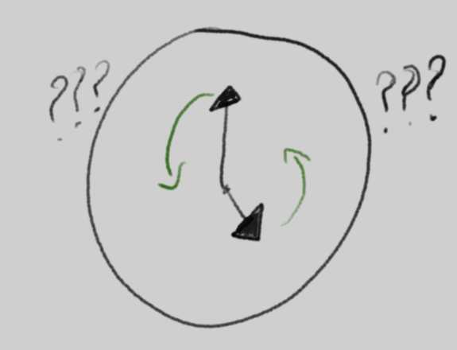
## What is this?
Implementations and testing suite of the time synchronization algorithms Berkeley and Cristian
## How do I run these?
### Cristian
Cristian algorithm is implemented simply in `express` and ol' faithful `html`.
#### Server
From root:
```bash
cd ./Cristian/Server
npm install
node server
```
#### Client
Simply run `Cristian/Client/index.html' in your favorite browser. For multiple instances, just open more tabs. Easy.

### Berkeley
Berkeley is implemented in `express` and `electron`.
#### Server
You only need one server
```bash
cd ./Berkeley
npm install
node server
```
#### Client
You can run multiple clients through electron. No problem.
```bash
cd ./Berkeley
npm install
npx electron .
```

## Preview
### Cristian
Client start:
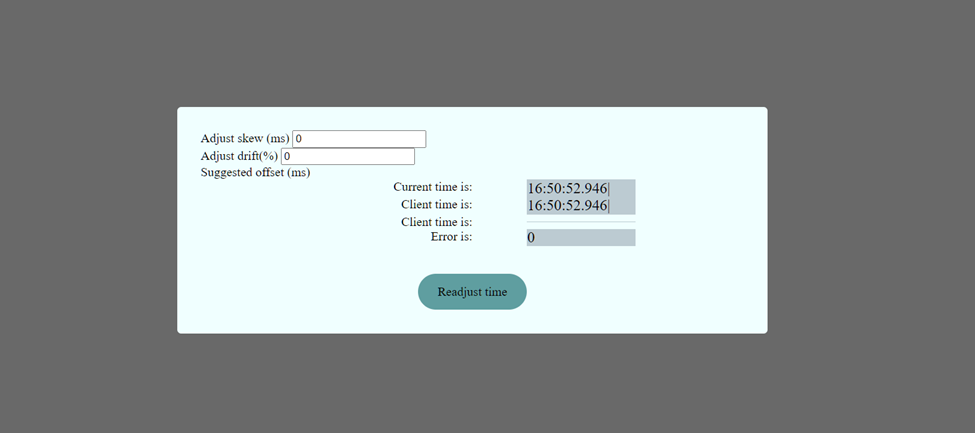
Client with time error:
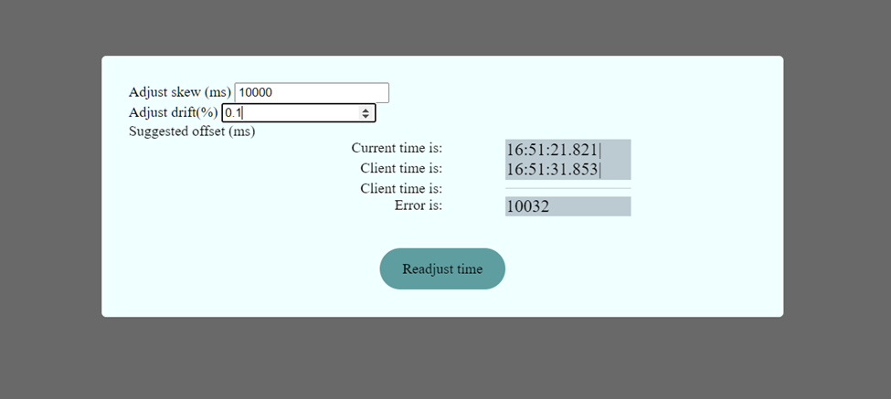
Server start:
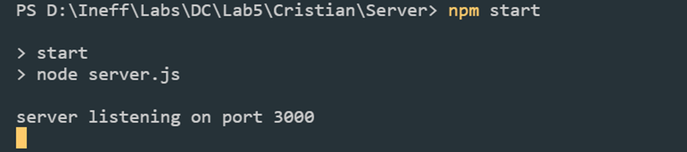
After client requests adjustment, client error is significantly reduced, down to processing delay:
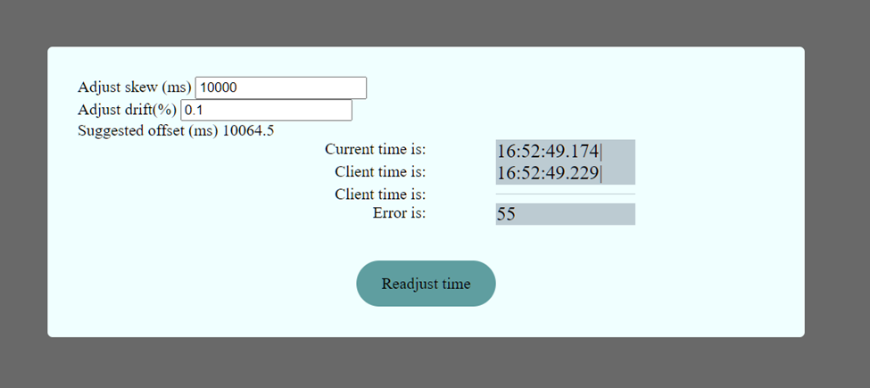
And that's it for Cristian.
### Berkeley
Server starts:
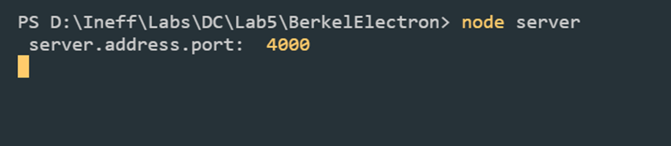
Clients start:
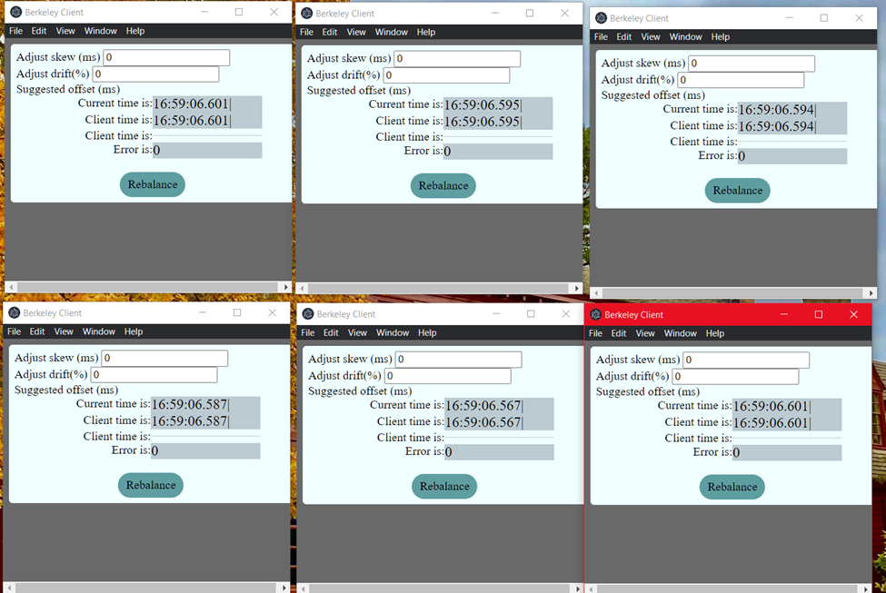
One client has the wrong time:
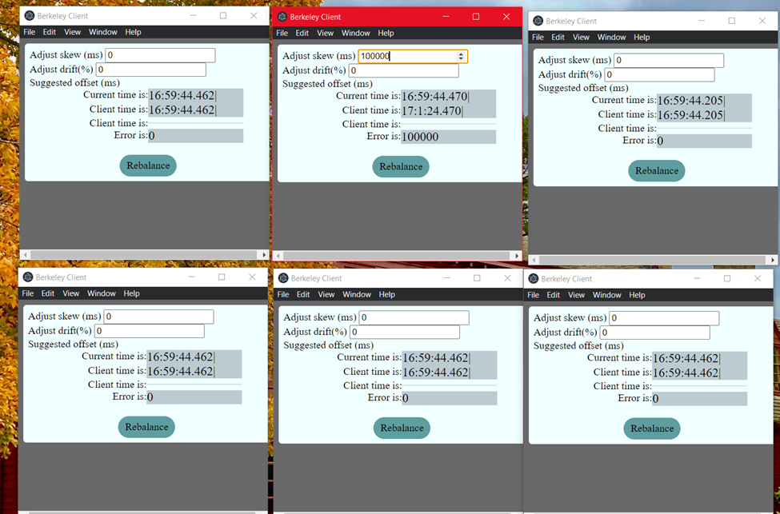
Clients after rebalance (client times are comparable):
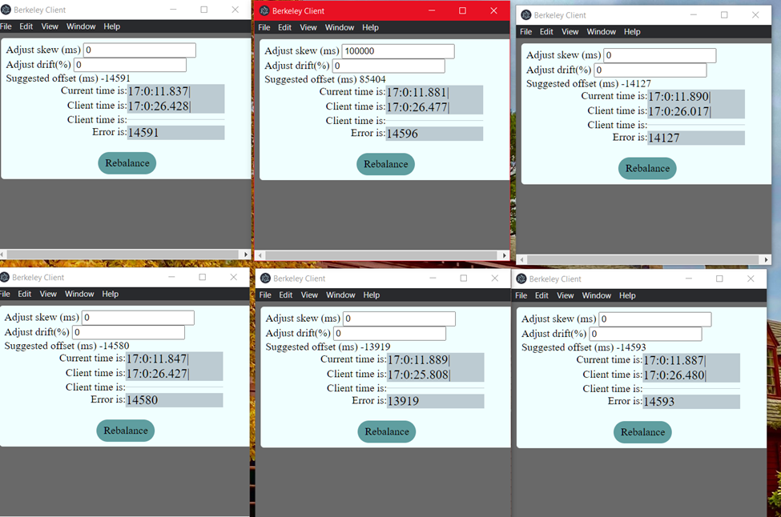
Server handling it all during rebalance:
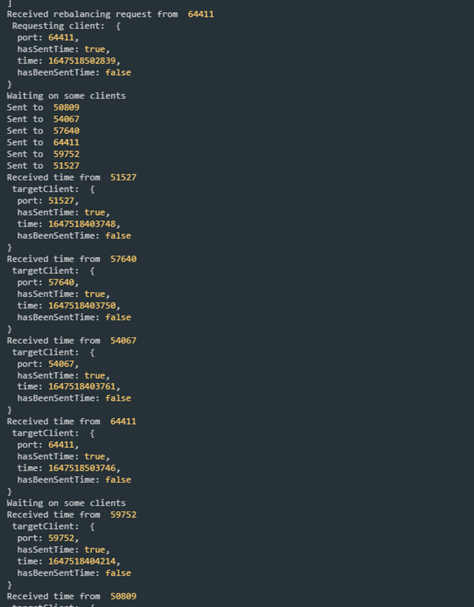
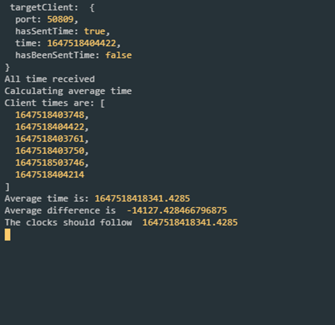
## Why did I make this?
We had lab work for the subject of Distributed Computing. At the time, for the semester project of the same course, I was exploring desktop app tech that would be fast and convenient. So of course I was looking at Electron.

This was an opportunity to stress test Electron and I took it.
